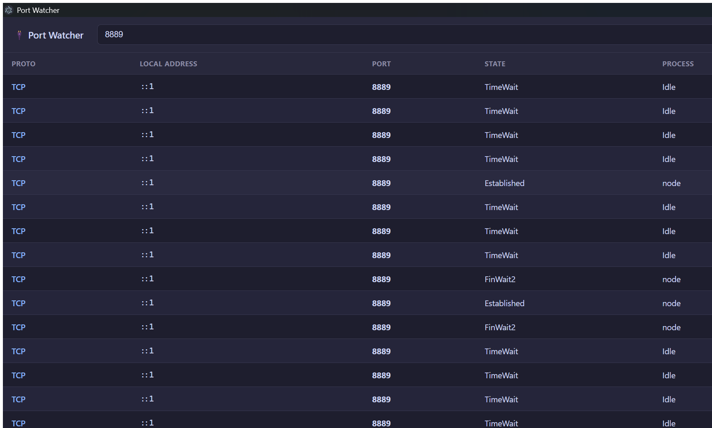

# 🔌 Port Watcher

[](https://github.com/HafezHammamy/port-watcher)
[](https://www.electronjs.org/)
[](LICENSE)
[](CONTRIBUTING.md)

A simple, fast desktop app for Windows to **watch, search, and kill** processes by the network ports they use. Built with [Electron](https://www.electronjs.org/).

> Ever hit `Error: listen EADDRINUSE: address already in use :::3000`? Open Port Watcher, type `3000`, and kill it — no more hunting through `netstat` and `taskkill`.



> 💖 If this saved you some time, consider [starring the repo](https://github.com/HafezHammamy/port-watcher) — it really helps!

## ✨ Features

- 📋 **Watch** — lists every TCP & UDP endpoint with the process that owns each port
- 🔍 **Search** — live filter across port, process name, PID, address, or state
- ❌ **Kill** — one click (with confirmation) to terminate the process holding a port
- ↕️ **Sort** — click any column header to sort
- 🔄 **Auto-refresh** — optional 3-second polling

## 🚀 Getting started

You'll need [Node.js](https://nodejs.org/) (v18+) installed.

```bash
git clone https://github.com/HafezHammamy/port-watcher.git
cd port-watcher
npm install
npm start
```

### Build a standalone installer

```bash
npm run dist
```

This produces a Windows installer in `dist/` (via [electron-builder](https://www.electron.build/)) that runs without needing Node installed.

## 🛠️ How it works

The Electron main process shells out to PowerShell:

- **Listing** — `Get-NetTCPConnection` + `Get-NetUDPEndpoint`, joined with `Get-Process` to map each owning PID to a process name, returned as JSON.
- **Killing** — `Stop-Process -Id <pid> -Force`.

The renderer (UI) talks to the main process over a locked-down `contextBridge` (no `nodeIntegration`).

> **Note:** Killing system/service-owned processes (e.g. PID 4 / SYSTEM) requires running the app **as Administrator**.

## 🤝 Contributing

Contributions are very welcome! See [CONTRIBUTING.md](CONTRIBUTING.md) for how to get started. Whether it's a bug fix, a new feature, or cross-platform support (macOS/Linux), feel free to open an issue or a pull request.

## 📄 License

[MIT](LICENSE) © Hafez Hammamy
